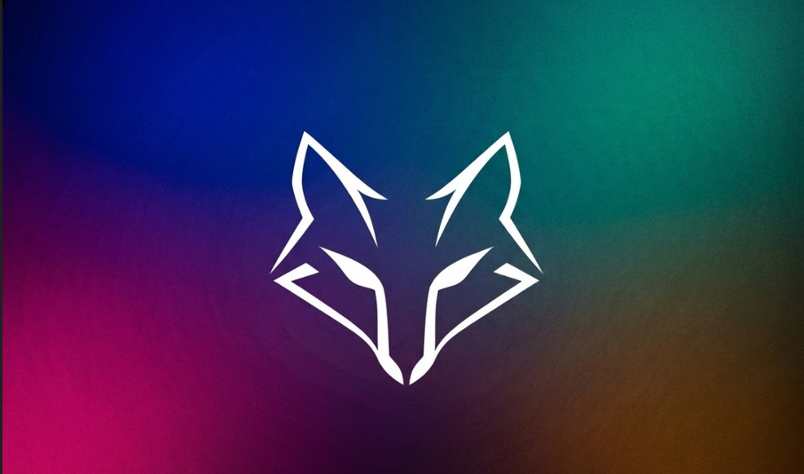

# Fox Bot Dökümantasyon



**Fox Bot**, Discord sunucuları için geliştirilmiş bir moderasyon botudur.


---

# Özellikler

* Sunucu moderasyonu
* Açık kaynak
* Basit kurulum
* Optimize ve hızlı çalışma

---

# Kurulum

## 1. Repoyu indirin

Terminal açın:

Windows'ta:

```
Win + R → cmd
```

Sonra şu komutu yazın:

```
git clone https://github.com/MustafaDevloper/FoxBot.git
```

---

## 2. Proje klasörüne girin

```
cd FoxBot
```

---

## 3. Gerekli paketleri yükleyin

```
pip install -r requirements.txt
```

---

# Kullanım

Botu başlatmak için:

```
python main.py
```

⚠ Önemli

`.env` dosyasını düzenleyin ve Discord bot tokeninizi ekleyin.

Örnek:

```
TOKEN=your_bot_token
```

---

# Komutlar

## Genel Komutlar

```
/yardim
/ping
/stats
/uptime
/shardinfo
```

---

## Moderasyon Komutları

```
/mute
/unmute
/kick
/ban
/purge
```

---

## Kullanıcı Bilgi Komutları

```
/avatar @user
/banner @user
/userinfo @user
/roleinfo rol
/serverinfo
```

---

## Rol Komutları

```
/addrole @user rol
/removerole @user rol
/lockrole rol
/autorole rol
```

---

## Log Sistemleri

```
/modlog
/leavelog
/joinlog
/editlog
/messagelog
/setlog kanal
```

---

## Güvenlik Sistemleri

```
/antimention
/antiraid
/antibot
/antilink on/off
/antispam on/off
/antiinvite
/capslimit
```

---

## Ticket ve Sistem Komutları

```
/ticket setup
/verification
/welcome kanal
/goodbye kanal
/setprefix
```

---

📌 Tüm komutları görmek için:

```
/yardim
```

---

# Proje Teknolojileri

* Python
* Discord API

---

# Katkı Sağlama

Projeye katkıda bulunmak için **pull request** gönderebilirsiniz.

---

# Lisans

Bu proje açık kaynaklıdır.

---

## Küçük tavsiyeler (çok fark yaratır)

README'ye şunları eklersen proje **çok daha ciddi görünür**:

* ⭐ **invite link**
* 📷 **bot ekran görüntüsü**
* 📊 **GitHub badge**

Örnek:

```


```

